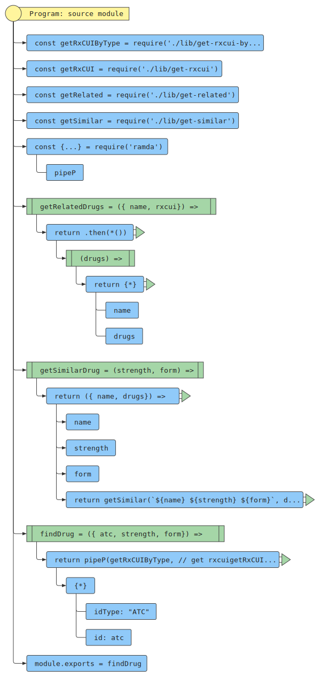
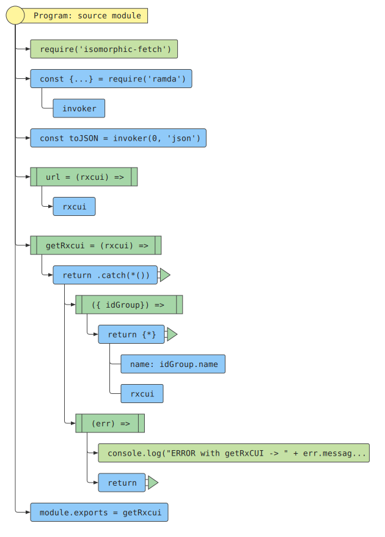

# atc2scd

This module takes an ATC Code, Strength and Form and uses **[Dice's coefficient algorithm](https://en.wikipedia.org/wiki/S%C3%B8rensen%E2%80%93Dice_coefficient)** to find the Semantic Clinical Drug:

## Usage

`npm install atc2scd`

```js
const findDrug = require("atc2scd");
findDrug({
  atc: "N03AX12",
  strength: "100 mg",
  form: "Capsule, hard"
}).then(semanticClinicalDrug => {
  assert.deepEquals(semanticClinicalDrug, {
    rxcui: "853201",
    name: "24 HR quetiapine 50 MG Extended Release Oral Tablet",
    synonym: "quetiapine 50 MG 24 HR Extended Release Oral Tablet",
    tty: "SCD",
    language: "ENG",
    suppress: "N",
    umlscui: "C2702061",
    rating: 0.696969696969697
  });
});
```

## Documentation

- [Docs](docs)

## FlowCharts

> index.js



> get-rxcui-by-type.js


> get-rxcui.js



> get-related.js


> get-similar.js


## Dependencies

Uses RXNorm REST API - https://rxnav.nlm.nih.gov/REST

## License

MIT
